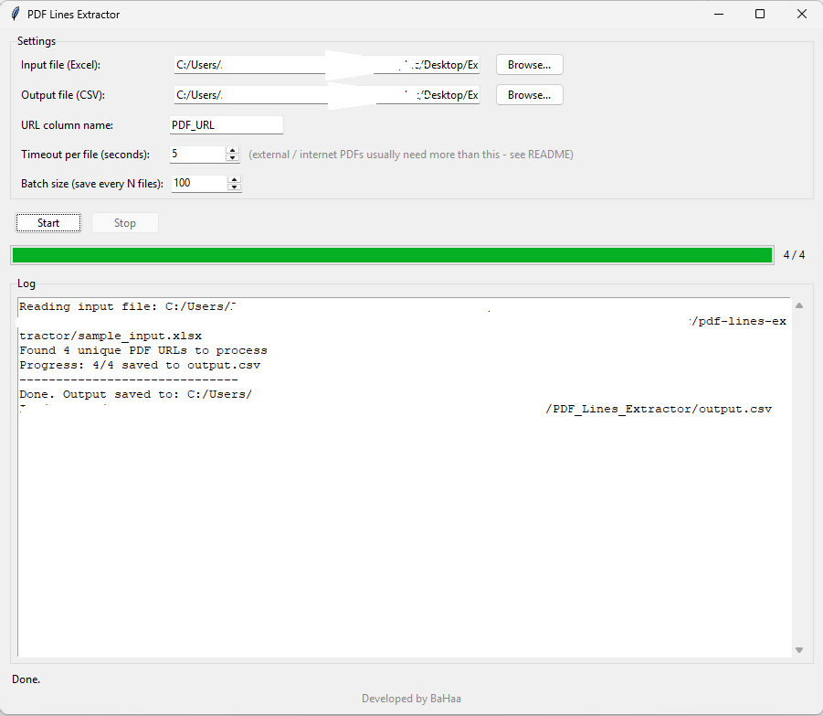

# PDF Lines Extractor

A small desktop tool that takes a list of PDF URLs from an Excel file, pulls
out every line of text from every page, and writes it all to a single CSV -
one row per line, with the original Excel columns kept alongside it.

I built this to automate a repetitive data-extraction task I was doing by
hand: pulling text out of thousands of PDFs and getting it into a flat,
analyzable format. It started as a Jupyter notebook script and I later
wrapped it in a GUI so it's easier to run without touching code each time.




## Features

- Point-and-click GUI (Tkinter, no extra install needed beyond Python itself)
- Per-file timeout, so one slow or broken PDF doesn't stall the whole batch
- Batched, incremental CSV writing - if the run gets interrupted, you don't
  lose everything that was already processed
- Live progress bar + log panel while it runs
- Configurable URL column name, timeout, and batch size from the UI

## How it works

```
Excel file (list of PDF URLs)
        |
        v
  for each batch of URLs:
        |
        v
  extract text, line by line, from each PDF
        |
        v
  append the results to the output CSV
```

Each PDF is processed in its own subprocess with a timeout. If it doesn't
finish in time, it's marked as failed and the tool moves on to the next one
instead of hanging.

## Requirements

- Python 3.9+
- A `Customs` module that provides the actual PDF parsing (see below)

Install the Python dependencies:

```bash
pip install -r requirements.txt
```

### About the `Customs` module

This project relies on an internal helper module called `Customs.py` for the
actual PDF text extraction - it's not included in this repo since it's part
of a larger internal toolkit. If you want to run this yourself, you'll need
to provide your own module with a function matching this interface:

```python
def Fitz_Parse_Safe(urls: list[str], how: str = "line") -> dict:
    """
    Takes a list containing a single PDF URL, downloads/opens it,
    and returns a dict: { url: [ [line1, line2, ...], [line1, ...], ... ] }
    where the outer list is pages and the inner list is lines on that page.
    Returns None or an empty dict on failure.
    """
```

A straightforward version of this could be built with
[PyMuPDF](https://pymupdf.readthedocs.io/) (`fitz`), opening the PDF and
calling `page.get_text("text")` per page, split into lines.

## Usage

1. Run the app:

   ```bash
   python gui.py
   ```

2. Pick your input Excel file. It needs at least one column with PDF URLs
   (default column name: `PDF_URL` - you can change this in the UI if yours
   is named differently). Any other columns in the file are carried through
   to the output as-is.

3. Pick where you want the output CSV saved.

4. Adjust the timeout / batch size if needed (see below for why the
   defaults are what they are).

5. Hit **Start**. You can hit **Stop** at any point - it'll finish the
   current batch and stop cleanly rather than cutting off mid-write.

### Sample input

`sample_input.xlsx` is included so you can try the tool immediately without
needing your own data. It points to a handful of well-known, publicly
available papers on [arXiv](https://arxiv.org) - stable links, no auth
required, safe to share.

## Design decisions

A couple of the default settings look arbitrary at first glance, so here's
the reasoning:

**Timeout per file: 5 seconds.** This was tuned against an internal source
where PDFs load quickly and reliably (roughly 1000 PDFs per 50 seconds in
practice). If you're pointing this at PDFs on the open internet instead
(like the sample file above), external servers are slower and less
predictable - bump this up to 20-30 seconds or you'll see files fail with a
timeout that would've succeeded given more time.

**Batch size: 100.** This is a balance between three things:
- *data safety* - smaller batches mean less is lost if the process gets
  killed mid-run, since we write to CSV after every batch
- *I/O overhead* - too small, and you're opening/writing the file constantly
- *memory* - each batch is garbage-collected (`gc.collect()`) once it's
  written, so 100 keeps memory use predictable even on a run of 50,000+ PDFs

Both are exposed in the UI, so there's no need to touch the code to change
them for a different workload.

## Project structure

```
pdf-lines-extractor/
├── gui.py              # Tkinter interface
├── core.py             # extraction / batching / CSV-writing logic
├── sample_input.xlsx   # small public dataset to try the tool with
├── requirements.txt
├── LICENSE
└── README.md
```

`core.py` and `gui.py` are kept separate on purpose - the extraction logic
doesn't know or care that it's being driven by a GUI, which makes it easier
to read, test, or reuse (e.g. from a command-line script) later.

## Building a standalone .exe (optional)

If you want to hand this to someone without Python installed:

```bash
pip install pyinstaller
pyinstaller --onefile --windowed gui.py
```

The `.exe` will show up in `dist/`. It's not checked into this repo (binary
files don't belong in source control) - if you want to distribute one,
attach it to a [GitHub Release](https://docs.github.com/en/repositories/releasing-projects-on-github)
instead of committing it.

## Adding the screenshot

Record a short (10-15s) screen capture of the app running - opening a file,
hitting Start, watching the progress bar move. [ScreenToGif](https://www.screentogif.com/)
works well on Windows. Save it as `docs/demo.gif` and it'll show up at the
top of this README automatically.

## License

MIT - see [LICENSE](LICENSE).


---
Developed by Bahaa Lasheen

Documentation drafted with AI assistance, reviewed and refined by me.

